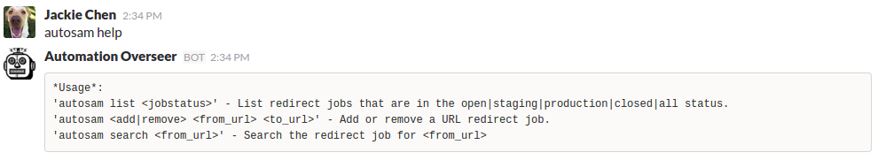

# Autosam

## Description
Autosam is a project that I created to automate the Akamai Cloudlets Edge Redirect from end to end, including add new rules, remove duplicated rules if there are any, push to staging, test in staging, push to production, test in production.     

## Design
Autosam is written in Bash and Python, and it utilizes a few technologies: [slack](https://slack.com/), [hubot](https://hubot.github.com/), [AWS DynamoDB](https://aws.amazon.com/documentation/dynamodb/) and [Cloudlets API](https://developer.akamai.com/api/luna/cloudlets/overview.html).

Here is the high level architecture


## Workflow
Here is the detailed workflow design


## Lifecycle
Autosam treats every redirect as a job. And job has different status in its lifecycle.  
  
    
## Setup
* Clone project.  
```bash
git clone https://github.com/jc1518/Autosam.git
```
* Install dependencies. 
```bash
pip install edgegrid-python
sudo apt-get -y install jq
or 
sudo yum -y install jq
```
* Create a AWS DynamoDB table for storing your job status.  

* Create Cloudlets configs and associte them to properties. Ensure you follow a good naming convention. e.g www.jackiechen.org use www_jackiechen_prod as the Cloudlets config name. If you do it differently, you have to update the below line in autosam_v2.sh to fit your case.
```bash
POLICYNAME=$(echo "$JOB" | cut -d' ' -f1 | cut -d'/' -f3 | cut -d'.' -f1-2 | t    r '.' '_')"_prod"
```      
* Setup your credentials in the [config](config) file, you need credentials for both Cloudlets API and AWS DynamoDB API calls. Also replace sample value with your email address, sites ... 

## Usage
Autosam supports two methods of submitting redirect jobs.
* Slack bot    
This requires to create a hubot and integrate it into Slack. The code can be found in myHubot repo. [lib/autosam.js](https://github.com/jc1518/myhubot/blob/master/lib/autosam.js) and [scripts/autosam.js](https://github.com/jc1518/myhubot/blob/master/scripts/autosam.js)


* Text file    
This allows you to do multiple redirects all in one go, just add all your redirects in a text file, one redirect per line. Then give it to autosam to process.
```bash
# for adding new redirects
./autosam_v2.sh <file>

# for testing  
./test_staging.sh  
./test_production.sh  
```  
## Best practice
As Akamai takes a long time to propagate the configuration changes, it is a good idea to consolidate as many redirects as possible into one go. In my environment, I created a cron job to run every 30 minutes. And users submit the redirect jobs via talking to the Slack bot that is shown above.    
```bash
0,30 08-17 * * 1-5 cd /home/autosam/cloudlets; ./all-in-one.sh >> log
```
Akamai will deny your API calls if the time in your machine is not correct. The best way to avoid that is to adjust your time before executing autosam. Here is a command you can use:
```bash
sudo date -s "$(curl -sD - google.com | grep '^Date:' | cut -d' ' -f3-6)Z"
```

## Redirect types
Autosam supports both basic URL redirects and URL with query string. This can be extended to support more types in the [Cloudlets module](https://github.com/jc1518/Autosam/blob/master/Cloudlets/__init__.py)


